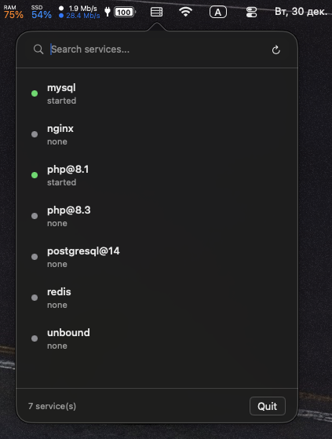
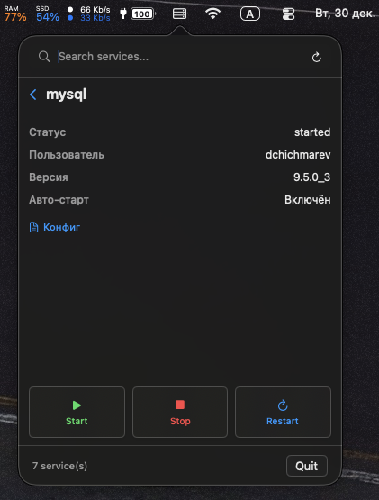

# 🍺 Homebrew Services Manager

> Элегантное управление Homebrew сервисами прямо из меню macOS

<div align="center">


**[Быстрый старт](#установка)** • **[Документация](#документация)** • **[Участие](#участие)**

</div>

---

## 📸 Скриншоты

<div align="center">

### Основное окно приложения


### Детали сервиса


</div>

---

## ✨ Возможности

### 🎯 Основной функционал
- **🎨 Интеграция с меню-баром** — Быстрый доступ из строки меню
- **📋 Список сервисов** — Все установленные сервисы в одном месте
- **⚡ Управление** — Запуск, остановка, перезагрузка одним кликом
- **🔄 Реал-тайм статус** — Анимированный индикатор текущих операций
- **🔔 Уведомления** — Оповещения о завершении операций
- **📊 Информация о сервисе** — Детальные данные каждого сервиса

### 📊 Информация о сервисах
| Параметр | Описание |
|----------|---------|
| **Статус** | Текущее состояние (запущен/остановлен) |
| **Пользователь** | От какого пользователя запущен |
| **PID** | ID процесса (когда активен) |
| **Версия** | Установленная версия пакета |
| **Автозапуск** | Запускается ли при входе в систему |
| **Конфиг** | Быстрый доступ к файлу конфигурации |
| **Логи** | Просмотр логов сервиса |

### ⚡ Производительность
```
┌─────────────────────────────────────┐
│ Фоновое обновление статуса          │ Не блокирует UI
├─────────────────────────────────────┤
│ Параллельная загрузка версий        │ Быстрое создание списка
├─────────────────────────────────────┤
│ Кэширование путей Homebrew          │ Экономия ресурсов
├─────────────────────────────────────┤
│ Async/Await конкурентность          │ Современный Swift
└─────────────────────────────────────┘
```

---

## 🚀 Установка

### 📦 Через Homebrew Cask (рекомендуется)

```bash
brew tap S1l3ntium/tap
brew install --cask homebrew-services-manager
```

После установки приложение появится в меню-баре. Просто запустите его, и он будет готов к работе!

📖 Подробнее: [INSTALLATION.md](INSTALLATION.md)

### 🔨 Компиляция из исходников

**Требования:**
- macOS 13.0+
- Swift 5.8+ (поставляется с Xcode 14.3+)
- Homebrew установлен

**Процесс:**

```bash
# 1. Клонирование репозитория
git clone https://github.com/S1l3ntium/homebrew-services-manager.git
cd homebrew-services-manager

# 2. Сборка
swift build -c release

# 3. Запуск
.build/release/HomebrewServicesManager
```

---

## 📖 Использование

### Базовая работа
1. **Запустите приложение** — иконка появится в меню-баре
2. **Кликните на иконку** (шкаф с серверами) в меню-баре
3. **Выберите сервис** из списка
4. **Управляйте сервисом** кнопками «Запустить/Остановить/Перезагрузить»

### ⌨️ Горячие клавиши
| Клавиша | Действие |
|---------|----------|
| **Cmd+Q** | Закрыть приложение (когда открыто меню) |

---

## 🏗️ Архитектура

### 🎨 Дизайн-паттерны
```
┌──────────────────────────────────────┐
│         Presentation Layer           │
│  (MenuBarPopoverView, ServiceRow)    │
├──────────────────────────────────────┤
│           ViewModel Layer            │
│     (ServiceListViewModel)           │
├──────────────────────────────────────┤
│          Business Logic              │
│    (BrewServiceManager)              │
├──────────────────────────────────────┤
│           Data Layer                 │
│   (Models, BrewError Handling)       │
└──────────────────────────────────────┘

Паттерны:
✓ MVVM (Model-View-ViewModel)
✓ Async/Await (Modern Concurrency)
✓ Combine (Reactive Updates)
```

### 📂 Структура проекта
```
Sources/
├── Core/
│   ├── BrewServiceManager          Интеграция с Homebrew CLI
│   ├── Models/                     Структуры данных
│   └── BrewError                   Обработка ошибок
├── App/
│   ├── ServiceListViewModel        Управление состоянием
│   ├── MenuBarPopoverView          Главный интерфейс
│   └── MenuBarController           Жизненный цикл приложения
└── SystemModule/
    └── NotificationsManager        Desktop уведомления
```

### 🧵 Модель потоков
```
┌─ Main Thread ──────────────────────┐
│ • UI обновления                    │
│ • Анимации                         │
│ • Обработка пользовательского ввода│
└────────────────────────────────────┘

┌─ Background Threads ───────────────┐
│ • Операции с Homebrew             │
│ • Загрузка версий сервисов         │
│ • Правильная отмена и очистка      │
└────────────────────────────────────┘
```

---

## 🎨 Дизайн

### Концепция
```
Liquid Glass Design (Жидкое стекло)
     ↓
┌─ Modern macOS Aesthetic ────────────┐
│ • Полупрозрачные компоненты        │
│ • Плавные анимации (0.15-0.7s)      │
│ • Отзывчивые состояния (hover/etc)  │
│ • Полная поддержка Dark Mode        │
│ • Высокое разрешение (Retina)       │
└─────────────────────────────────────┘
```

### Компоненты UI
| Компонент | Описание |
|-----------|---------|
| **Service Row** | Полностью кликабельная строка с кнопками действий |
| **Service Detail** | Организованная панель с информацией сервиса |
| **Pulse Indicator** | Анимированный индикатор во время операций |
| **Glass Buttons** | Современный стиль кнопок с эффектом стекла |

---

## 🌍 Локализация

Приложение готово к поддержке нескольких языков:

```swift
enum L10n {
    static let start = NSLocalizedString("start", ...)
    static let stop = NSLocalizedString("stop", ...)
    // ... и другие строки
}
```

**Поддерживаемые/готовые к поддержке:**
- 🇬🇧 English
- 🇷🇺 Russian (Русский)
- 🌐 Другие языки (инфраструктура готова)

---

## ⚠️ Обработка ошибок

Приложение обладает комплексной обработкой ошибок с понятными пользователю сообщениями:

```
Homebrew не найден
    ↓
[Показываются инструкции по установке]

Не удалось выполнить команду
    ↓
[Детальное описание проблемы]

Требуется администраторский доступ
    ↓
[Запрос пароля с объяснением]

Неверный формат вывода
    ↓
[Корректная обработка, сохранение функциональности]
```

---

## 👨‍💻 Разработка

### 🏗️ Собрать проект
```bash
swift build
```

### ▶️ Запустить в режиме разработки
```bash
swift run HomebrewServicesManager
```

### 🧪 Запустить тесты
```bash
swift test
```

### 📋 Стандарты кода
✓ Swift 5.5+ с современной конкурентностью
✓ Правильная обработка ошибок (LocalizedError)
✓ Ясные имена переменных и организация
✓ Без force unwrap и force cast

---

## 📋 Известные ограничения

- Требует установленный Homebrew
- Некоторые операции могут требовать пароль администратора
- Доступ к логам зависит от существования директории логов сервиса

---

## 🎯 Планируемые функции

```
┌─ v1.1+ Дорожная карта ──────────────────────┐
│                                             │
│ ☐ Групповые операции (запуск/остановка все) │
│ ☐ Фильтрация по статусу                     │
│ ☐ Пользовательские группы сервисов          │
│ ☐ Навигация только клавиатурой              │
│ ☐ Поддержка Touch Bar                       │
│ ☐ UI настроек сервисов                      │
│                                             │
└─────────────────────────────────────────────┘
```

---

## 🤝 Участие

Мы рады contributions! Пожалуйста, убедитесь:

✓ Чистая сборка без предупреждений
✓ Правильная обработка ошибок
✓ Современные async/await паттерны
✓ Информативные commit messages

```bash
# Создайте свою ветку
git checkout -b feature/your-feature

# Сделайте коммит
git commit -am "Add: описание вашей функции"

# Запушьте в свой форк
git push origin feature/your-feature

# Создайте Pull Request на GitHub
```

---

## 📚 Документация

- [**INSTALLATION.md**](INSTALLATION.md) — Подробное руководство по установке
- [**DISTRIBUTION.md**](DISTRIBUTION.md) — Информация о дистрибуции
- Локальные файлы скриптов (не отслеживаются в git):
  - `build-app-bundle.sh` — Создание .app bundle
  - `PUBLISH.sh` — Автоматизация релиза
  - `SCRIPTS_USAGE.md` — Руководство по скриптам

---

## 🛠️ Технический стек

| Компонент | Версия | Описание |
|-----------|--------|---------|
| **Swift** | 5.8+ | Основной язык программирования |
| **SwiftUI** | Latest | Фреймворк для UI |
| **AppKit** | macOS 13+ | Интеграция с системой |
| **Combine** | Latest | Реактивное программирование |
| **Foundation** | Standard | Базовые компоненты |

---

## 📄 Лицензия

MIT License — смотрите [LICENSE](LICENSE) для деталей

---

## 👨‍🔬 Об авторе

**Homebrew Services Manager** создан как демонстрация лучших практик разработки macOS приложений на Swift с использованием современных паттернов и инструментов.

<div align="center">

**[⬆ Вернуться наверх](#-homebrew-services-manager)**

---

**Версия:** 1.0
**Последнее обновление:** 2025-12-30
**Платформа:** macOS 13.0+
**Статус:** ✅ Готово к использованию

</div>
